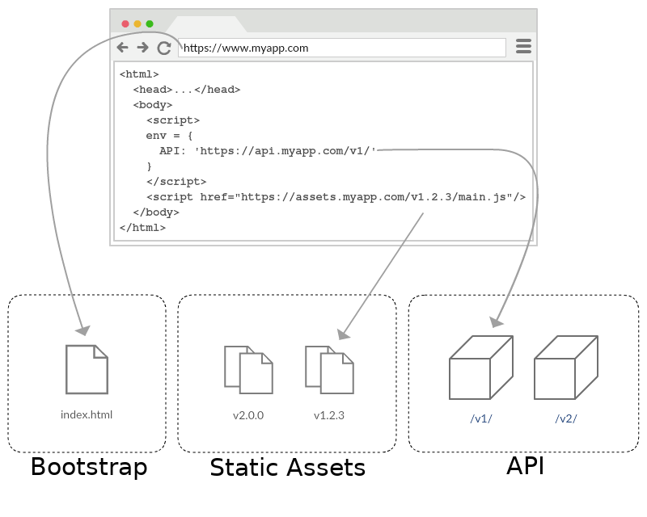

<!--
SPDX-FileCopyrightText: 2012-2026 Open Assessment Technologies S.A.

SPDX-License-Identifier: AGPL-3.0-only OR LicenseRef-TAO-Commercial-License
-->

# Running tao-deliver-fe

This repository contains only the frontend parts of Deliver. There are 2 apps:

1. [deliver-app](../packages/deliver-app/README.md) - the Test Runner used for taking an assessment as a delivery execution (standard mode and review mode)
2. [previewer-app](../packages/previewer-app/README.md) - the Test Runner used for previewing unpublished test content

It's not usually needed to run both apps together, although it is possible (as long as assigned ports do not conflict).

In both apps, the frontend runs as an [immutable web app](https://immutablewebapps.org/):

- The _bootstrap_ is the app entrypoint, a dynamic service that reads environment variables, generates the `index.html` and loads the API and the static assets.
- It loads and sends data to a backend, as an external service _API_.
- It loads the JavaScript and CSS runtime as external static assets.

## Configuration

Ensure the environment is set according to your setup. URLs are defined in the `.env` file as:

- `COMPOSE_PROFILES`: must be set (`deliver`, `previewer` or `all`) if launching wtth docker-compose
- `PATH_PREFIX`: the path prefix of the application (e.g. `/deliver`). If no path prefix is defined, use `/` or leave empty
- `API_URL`: the URL of the backend (deliver-app)
- `STATIC_URL`: the URL of the static assets (deliver-app)
- `PREVIEW_API_URL`: the URL of the translation proxy API (previewer-app)
- `PREVIEW_STATIC_URL`: the URL of the static assets (previewer-app)
- `NPM_TOKEN`: token with `@oat-sa-private` read permissions

To run the applications, you can either use the Docker containers or run from their local Node servers. For more information please consult the documentation at the root of each application.
