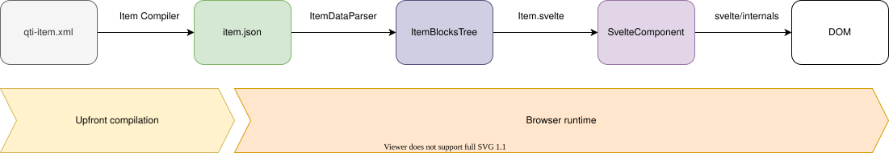
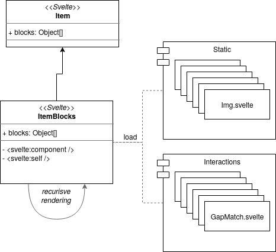

<!--
SPDX-FileCopyrightText: 2012-2026 Open Assessment Technologies S.A.

SPDX-License-Identifier: AGPL-3.0-only OR LicenseRef-TAO-Commercial-License
-->

# Item Runner Provider Architecture

The purpose of an Item Runner <u>Provider</u> is to render to the test taker an item, allowing him to interact with it and collect the responses.

## Provider and API

In TAO, item and test runner are using the [delegation pattern](https://en.wikipedia.org/wiki/Delegation_pattern).
The item runner front object, that contains the main API is available in the package [@oat-sa/tao-item-runner](https://www.npmjs.com/package/@oat-sa/tao-item-runner), then each _provider_ (or _delegate_) provides an implementation.

Each provider must be registered against the item runner. Let's create a dummy item runner provider that just displays the item data.

```js
import itemRunner from 'taoItems/runner/api/itemRunner.js';

const providerName = 'itemDataViewerProvider';
const provider = {
    init(itemData, done) {
        //receive the item data as an object
        this.data = JSON.stringify(itemData);
        done();
    },

    render(container, done, options = {}) {
        container.innerHTML = `<pre>${this.data}</pre>`;
        done();
    }
};

//register once
itemRunner.register(providerName, provider);
```

After the provider has been registered against the item runner (once and only once), the item runner can be instantiated to use the provider:

```js
import itemRunner from 'taoItems/runner/api/itemRunner.js';

itemRunner('itemDataViewerProvider', itemData)
    .on('error', err => console.error(err))
    .init()
    .render(document.body);
```

Inside the provider's methods, you have access to all methods of the item runner from the current scope:

```js
const provider = {
    init(itemData, done) {
        //the "setState" method comes from the item runner, not the provider
        this.setState({ initialState: true });

        done();
    }
};
```

## From QTI to the DOM



### Compiled item

This provider aims to render QTI 2.2 items. QTI items data is formatted in XML and archived as a ZIP file. This format is very difficult to handle on the browser and contains data about the correct response. So TAO uses in the item runner a _compiled item_ format (sent by the backend). This compiled item is formatted in JSON, and all sensitive data is removed.

Some samples can be found in the [presets](../sandbox/presets).

### Item Blocks Tree

The main challenge of this provider is to transform a _compiled item_ into a Svelte component.

Considering that:

-   the content of an item is a tree of tags (QTI specific, HTML, MathML, etc.).
-   the content of an item is not known in advance, any combination can be supported.
-   the compiled item contains some HTML as a string, with placeholders to replace by a dynamic element. For example`<p>{{img_123}}</p>`, where `{{img_123}}` will be replaced by another tree.
-   Svelte uses a compilation approach, so all required component classes in the item have to be known in advance.
-   for dynamic rendering Svelte offers the following tools:
    -   [`<svelte:self />`](https://svelte.dev/docs#svelte_self) for recursive rendering
    -   [`<svelte:component this={ComponentClass} />`](https://svelte.dev/docs#svelte_component) to render a dynamic component
-   Svelte doesn't support dynamic HTML tags.

To solve the dynamic rendering, it appeared we needed an intermediary format: the _item blocks tree_.

An example of _item blocks tree_:

```js
[
    {
        type: 'text',
        content: 'Lorem ipsum '
    },
    {
        type: 'html',
        content: '<strong><a href="#">sit dolor</a></strong>'
    },
    {
        type: 'container',
        component: Div,
        content: 'div',
        props: {
            attributes: {
                class: 'row'
            },
            itemIdentifier: 'item-2'
        },
        children: [
            {
                type: 'text',
                content: 'consectetur adipiscing elit'
            },
            {
                type: 'element',
                component: TextEntryInteraction,
                content: 'interaction_textentryinteraction_5e5e7a7132dd8915047479',
                props: {
                    baseType: 'string',
                    cardinality: 'single',
                    itemIdentifier: 'item-2',
                    responseIdentifier: 'RESPONSE'
                },
                children: []
            },
            {
                type: 'text',
                content: 'elementum lorem'
            }
        ]
    }
];
```

We want it to be rendered like this (as a Svelte component)

```svelte
Lorem ipsum
<strong><a href="#">sit dolor</a></strong>
<Div itemIdentifier="item-2" attributes={{ class: 'row' }}>
    consectetur adipiscing elit
    <TextEntryInteraction
        baseType="string"
        cardinality="single"
        itemIdentifier="item-2"
        responseIdentifier="RESPONSE" />
    elementum lorem
</Div>
```

The item blocks tree is a collection of JavaScript objects with the following types:

-   `html`
-   `text`
-   `container`
-   `element`

##### `html`

Blocks with `html` type render the `content` as HTML to the current node.

##### `text`

Blocks with `text` type render the `content` as text to the current node.

##### `container`

Blocks with `container` type render the node as a Svelte component.
The `component` property must contain the Svelte class from a [non-interactive element](../src/runner/static).
`props` are given as the component property.
This block can have `children` of any type.
This type differs from the `html` type because it contains an `element` block in its children.

##### `element`

Blocks with `element` type render the node as a Svelte component (the name _element_ is used to match the naming in the compiled item).
The `component` property must contain the Svelte class from an [interaction](../src/runner/interaction) or a [dynamic element](../src/runner/static). The `props` are expanded in the component property.

### The Parser

The [itemDataParser](../src/runner/item/parser/itemDataParser.js) is used to transform the compiled item data to an item blocks tree.

```js
const { itemIdentifier, itemLang, itemTitle, blockTree } = itemDataParser(compiledItemData);
```

The parser will extract each block from the compiled item data, but will also parse the attributes of each element in order to create the properties for the target components.
For example, if an interaction is found in the item, the parser will also extract the `responseIdentifier`, the `baseType` and `cardinality` as properties for the interaction component.

#### Mappers

In order to support differences between the API of components and the attributes given in the compiled item, a [mapper](../src/runner/item/parser/mapper) can be defined.
A mapper can be defined per element or container type.

For interactions, mappers can also be used to map the attributes of a choice.

A mapper exports an object with at least one of the 3 methods:

-   `mapElement` to map the element object before the property parsing
-   `mapProperties` to map the properties of the component
-   `mapChoiceProperties` to map the properties of the component choices

### Item block



The provider renders the item within a main Svelte component: [Item.svelte](../src/runner/).
This component renders the item blocks tree through the [ItemBlocks.svelte](../src/runner/item/blocks/ItemBlocks.svelte) component.
As you can see this component renders recursively each _block_ based on its type:

```svelte
{#each blockTree as block}
    {#if block.type === blockTypes.html}
        {@html block.content}
    {:else if block.type === blockTypes.text}
        {block.content}
    {:else if block.type === blockTypes.container || block.type === blockTypes.element}
        <svelte:component this={block.component} {...block.props}>
            {#if block.children}
                <svelte:self blockTree={block.children} />
            {/if}
        </svelte:component>
    {/if}
{/each}
```

## State Management

The item runner state is handled by:

1. A multi-items [Svelte Store](https://svelte.dev/docs#svelte_store) for the state: [itemsStateStore.js](../src/runner/itemsStateStore.js)
2. A multi-items [Svelte Store](https://svelte.dev/docs#svelte_store) for the session: [itemsSessionStatusStore.js](../src/runner/itemsSessionStatusStore.js)
3. An internal [Svelte Context](https://svelte.dev/docs#setContext)

### ItemsStateStore

It's a writable store that lets you:

-   store the state and responses for multiple items
-   access to the state and responses for the current item using the `itemIdentifier`
-   access the state and responses for a given interaction from the `responseIdentifier`

See the [item state store documentation](./itemStateStore.md)

### itemsSessionStatusStore

Similar in structure to the `ItemsStateStore`, this writable store holds the current `sessionStatus` value (`initial`, `interacting`, `closed`...) for multiple items. All the possible states are explained in the [session state documentation](./itemSessionStatus.md). This store lets you:

-   access to, and set the `sessionStatus` for the current item using the `itemIdentifier`

### The context

A context is available by all components instantiated from [Item.svelte](../src/runner/item/Item.svelte). This context provides a way to share between all components:

-   the instance of the configured asset manager
-   a mechanism to register a "loading" element
-   a logger
-   the language codes

In any component of the item runner, the `itemContext` can be retrieved using the `itemIdentifier`:

```js
import { getContext } from 'svelte';

//the itemIdentifier should be available in every component
export let itemIdentifier;

const itemContext = getContext(itemIdentifier);
```

#### The asset manager

All assets URL should be resolved using the asset manager:

```js
export let src;

const assetManager = itemContext.getAssetManager();

//resolve assets URL
src = assetManager.resolve(src);
```

#### Register a loading element

If a sub-component renders asynchronously and we consider the item runner should wait for it, we can register the loading. This will help the item runner to decide when the item can be presented to the test taker.

```js
//wait for an image to be loaded
itemContext.registerLoadingElement(new Promise( (resolve, reject) => {
    imageElement.addEventListener('load', resolve);
    imageElement.addEventListener('error', reject);
});
```

#### Languages

The `itemContext` provides different language codes:

-   `getUserLang` provides the language of the test taker.
-   `getItemLang` provides the language of the item content.
-   `getInstructionsLang` provides the language of the test taker when different from the item language, used for some instructions.

### The settings store

The item runner has a store that contains the settings of the item runner. Those settings comes from `options` and are reactive. You can expect the settings to change during the item session.

The settings store is scoped by item and is a simple writable store:

```js
import { getItemSettingsStore } from './itemsSettingsStore.js';

const settingsStore = getItemSettingsStore(itemIdentifier);

settingsStore.subscribe(settings => console.log(settings));
```

#### The tool store

For tools managed by the item itself (usually tools are not part of the item), we can handle the state of the of the tools through an internal store. The lifecycle is the following:

-   The tool state is set through the item runner `options` (this can evolve in the future and the tools state could be set through `itemData`). The store is fed by the initial tool state.
-   The item and interactions can read and update the state of the tools through the store.
-   The item runner notify changes of the tool state using a `toolsstatechange` event.

The store itself is a writable store, structured by element (interaction or static element) and by tool.

```js
import { getItemToolsStateStore } './itemsToolsStateStore.js';

const toolsStateStore = getItemToolsStateStore(itemIdentifier);

const eliminatedChoices =  toolsStateStore.getElementToolState('RESPONSE_1', 'choiceElimination');
```
