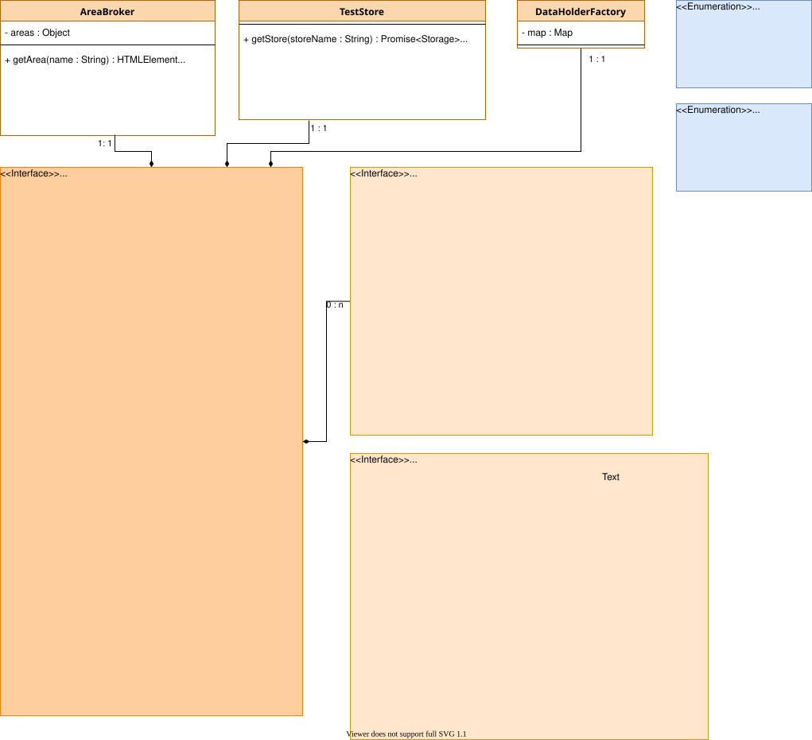
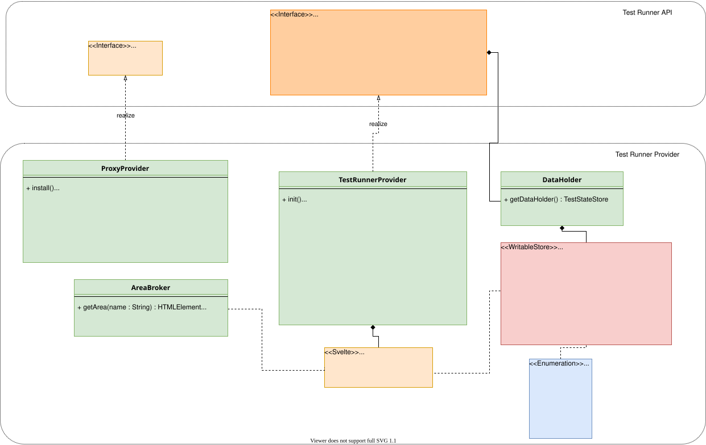
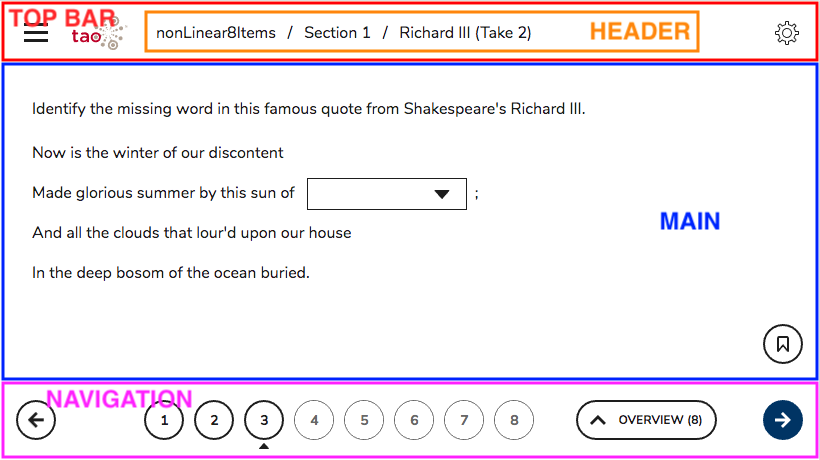
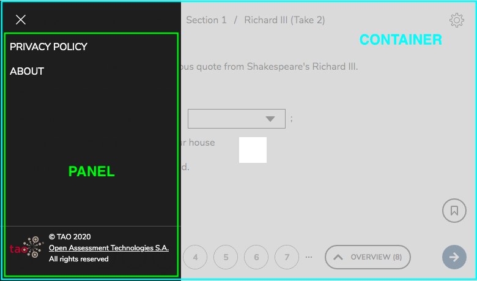
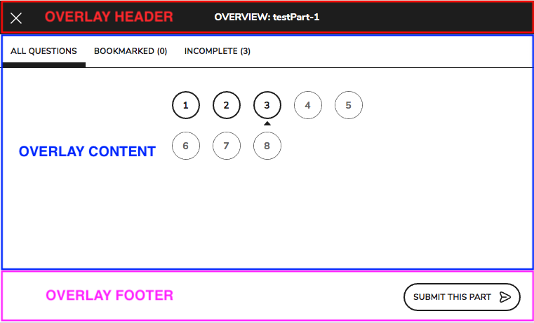
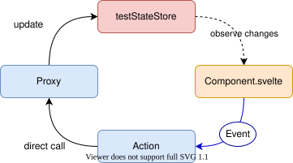
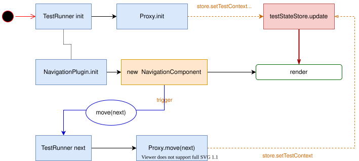

<!--
SPDX-FileCopyrightText: 2012-2026 Open Assessment Technologies S.A.

SPDX-License-Identifier: AGPL-3.0-only OR LicenseRef-TAO-Commercial-License
-->

# Test Runner Provider Architecture

The purpose of a Test Runner <u>Provider</u> is to render to the test taker a test and it's items, allowing him to navigate with it and collect the responses.

## Provider and API

In TAO, item and test runners are using the [delegation pattern](https://en.wikipedia.org/wiki/Delegation_pattern).
The test runner front object, that contains the main API is available in the package [@oat-sa/tao-test-runner](https://www.npmjs.com/package/@oat-sa/tao-test-runner), then each _provider_ (or _delegate_) provides an implementation.

Each provider must be registered against the test runner. Please note the proxy and the item runner must also be registered before the instantiation because they are also using the same pattern.

```js
import testRunner from 'taoTests/runner/runner.js';
import testRunnerProvider from '@oat-sa-private/tao-item-runner-qtinui/src/runner/qti.js';
import proxy from 'taoTests/runner/proxy.js';
import proxyProvider from '@oat-sa-private/tao-item-runner-qtinui/src/runner/proxy/actionProxy.js';
import itemRunner from 'taoItems/runner/api/itemRunner.js';
import itemRunnerProvider from '@oat-sa-private/tao-item-runner-qtinui/src/runner/qti.js';

testRunner.registerProvider('qtinui', testRunnerProvider);
proxy.registerProvider('qtinui', proxyProvider);
itemRunner.register('qtinui', itemRunnerProvider);
```

Once the provider has been registered against the item runner (once), the item runner can be instantiated to use the provider:

```js
import testRunnerFactory from 'taoTests/runner/runner.js';
import * as plugins from '@oat-sa-private/tao-item-runner-qtinui/src/runner/plugins';

testRunnerFactory('qtinui', Object.values(plugins), {
    serviceCallId: `test-session-id-${Date.now()}`,
    renderTo: document.body,
    proxy: 'qtinui'
})
    .on('error', err => console.error(err))
    .init();
```

## Test Runner API

The following diagram describes the main modules involved in the test provider API:



-   The `TestRunner` defines the public API of the test runner and will delegate some parts of its lifecycle to the TestRunner Provider.
-   The `AreaBroker` is an object that contains pointers to the main areas in the DOM, like the element that will contain the item or the navigation element.
-   The `TestStore` lets you access a generic object store (IndexedDB or LocalStorage) to store test data.
-   The `DataHolder` contains the current test data and state: testMap and testContext
-   The `Plugin` API defines the public API of any test runner plugin that adds some features to the test runner. The list of plugins is given by configuration to the test runner.
-   The `Proxy` API defines the public API of the proxy, a component dedicated to communicating data with a backend.

## Test Runner Provider

Here is a high-level description of the provider implementation



-   The [provider](../src/runner/qti.js) is the implementation of the test runner for QTI and the new UI. It implements the main lifecycle and it in charge of loading the other modules.
-   A dedicated [areaBroker](../src/runner/areaBroker.js) is implemented, the default one was expecting the DOM element to be already mounted and didn't fit well with the lifecycle. This version allows you to set the areas at a later stage. The runner provider loads it through `loadAreaBroker`.
-   The `DataHolder` points to the store of the current session from [testsStateStore](../src/runner/testsStateStore.js). Calling `testRunner.getDataHolder` is like calling `getTestStateStore(testRunner.getConfig().serviceCallId)`. The API is compatible.
-   A proxy, the [actionProxy](../src/runner/proxy/actionProxy.js) is available to load and send data to a compatible REST endpoint.
-   The [TestLayout](../src/runner/TestLayout.svelte) contains the main layout of the test runner

## Layout and areas

The test runner layout is implemented as a Svelte component: [TestLayout.svelte](../src/runner/TestLayout.svelte). It contains the main regions of the test runner but not the actual content. Since it's a Svelte component, we need to "mount" it to get the references to the DOM elements that will be used in the `areaBroker`.

Please note that the `TestLayout` is mounted during the initialization. So the areas will be available only after the provider initialization.

Given the current implementation we have the following areas:

-   the container (where the Test Runner is appended)
-   the main content area (where the item will be displayed)
-   the top bar area
-   the header area (within the top bar, where the test title is displayed)
-   the navigation area
-   the panel area (within the left panel, once open)
-   the overlay header area
-   the overlay content area
-   the overlay footer area
-   the jump menu area





## Data and state

To run a test session the test runner requires the following data:

### Configuration

The configuration contains information on how to run the current test session. The configuration doesn't change during the test. Especially:

-   the `serviceCallId`: the session unique identifier
-   the list of providers (the implementations of each module and plugins)
-   `options` it contains feature flags and some parameters like `exitUrl` or the themes.

### TestMap

The `TestMap` is a tree that represents the structure of a test (test parts, sections and items). The test map contains:

-   For each level, the definition and properties like title and attributes.
-   For items, it also contains some state (viewed, answered, attempts left, etc.).
-   Each level contains also information about the position in the test and stats (total, viewed, etc.)
    We usually receive it once and maintain it during the test session.

In some situations, the testMap structure can change during a test, especially for adaptive tests.

### TestContext

The `TestContext` represents the current situation in the test session. The main information that needs to be extracted from the text context are:

-   `itemPosition` the position of the _current_ item in the test
-   `itemIdentifier` the identifier of the _current_ item in the test
-   `sectionId` the identifier of the _current_ section in the test
-   `testPartId` the identifier of the _current_ test part in the test
-   the item and test lifecycle state from the backend perspective

**The test context comes often with more informations, they have to be retrieved and manipulated in the test map. They're available only for backward compatibility and can be removed at any time.**

### State management

The state (`TestMap` and `TestContext`) are kept by the [testsStateStore](../src/runner/testsStateStore.js), a writable Svelte store.

The provider is set up to access it through the `DataHodler` (which links to the `testsStateStore` for the current session).

So calling `testRunner.getDataHolder()` gives you access to the store, that holds the `TestMap` and `TestContext`.

We can call either

-   `testRunner.getDataHolder().getTestContext()`
-   `testRunner.getTestContext()`
-   `getTestStateStore(serviceCallId).getTestContext()`

The preferred way is to use the store inside components and the data holder from plugins or the provider.

### State lifecycle

The state updates using the following cycle:



It means components and plugins can read and observe changes from the store. Any modification will be done by calling a method of the test runner, and the proxy will modify the state.

In the context of a navigation the state will be updated as in the diagram below:



### Tests sessions states and status

The `TestContext` contains some state regarding the test and item sessions. Those states should be considered as "server-side states", we check them to synchronize the "client-side state".
They can have the following values like `initial`, `interacting` or `closed`. If a state is interacting it should be understood as: "the test session can get interacted by the test taker". But the test runner on the client side isn't yet ready for the test taker to interact with the item. It has to load the item, render it, etc. so it's still loading.

Keeping those states lets us check if a session is still valid, but then we handle an internal status to synchronize plugins and components: the test session status.

The test session **status** can have the following values:

-   `initial`
-   `loading`
-   `interacting`
-   `feedback`
-   `overlay`
-   `error`

The status is available through a Svelte store, so in a component you can read it

```svelte
<script>
import { getTestSessionStatusStore } from './testsStateStore.js';
import { testSessionStatus } from './sessionStates.js';

const status = getTestSessionStatusStore(serviceCallId);
</script>
{if $status === testSessionStatus.loading}
  <Loader text="please wait" />
{#if}
```

The test runner provider has some helpers

```js
import { testSessionStates, testSessionStatus } from './sessionStates.js';

const isInteracting = this.getTestSessionStatus() === testSessionStatus.interacting;
this.setTestSessionStatus(testSessionStatus.error);
```

### Test Session User Data

The test runner also handles the storage of data linked to the user's test session. It contains data about:

-   test taker preferences and settings
-   internal tools, like a notebook, a calculator or a scratchpad

The service `TestSessionUserDataService` provides you access to Svelte stores to handle those data. It also provides a way to synchronize them with another storage.

#### Settings Store

To access the settings store of a test session, you need the `serviceCallId`:

```js
import { getTestSessionUserDataService } from './session/testSessionUserDataService.js';

// get a service instance by test session
const testSessionUserDataService = getTestSessionUserDataService(serviceCallId);
const settingsStore = testSessionUserDataService.getSettingsStore();

settingsStore.subscribe(settings => console.log('Settings have been updated to', settings));
```

The settings store contains a plain object.

#### Tools Store

To access the tools store of a test session, you need the `serviceCallId`:

```js
import { getTestSessionUserDataService } from './session/testSessionUserDataService.js';

// get a service instance by test session
const testSessionUserDataService = getTestSessionUserDataService(serviceCallId);
const toolsStore = testSessionUserDataService.getToolsStore();

toolsStore.setItemToolState('item-1', 'lineReader', { line: 12 });
toolsStore.setTestToolState({ scratchpad: [12, 13, 14] });
```

The tools store contains a structured object. We distinguish the tools linked to items and the tools linked to the test.

#### Synchronization

The test session user data service synchronizes the stores values to the `TestStore` (IndexedDB).
It starts to synchronize when the runner initialize and stops when it is destroyed.
